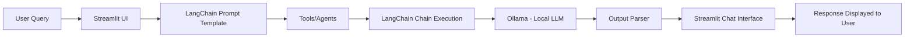

<h1 align='center'>🤖 PainCodes Chatbot</h1>

> A **ChatGPT-like AI assistant** built using **LangChain** and an **open-source Llama2 model via Ollama**.
> <p align="center">
  
[](https://git.io/typing-svg)
</p>

---
#### 🌐Live Demo : https://paincodes-chatbot.streamlit.app/

<a href='https://www.linkedin.com/posts/mohamed-imraan-full-stack-developer_paincodes-chatbot-ai-ugcPost-7445794077645881344-FIEf?utm_source=social_share_send&utm_medium=member_desktop_web&rcm=ACoAAFY3K0cBU_78C0iKCc_Q5cnqtXRuF44rzCg'>
></a>

### 🤖💭 This chatbot can answer **general questions, coding queries, and AI topics** while running **completely locally without any paid API keys**.
---
> <p>If you want to create a chatbot, you don't need to train an entire model from scratch. We can use already trained open-source LLMs like OpenAI (ChatGPT) or Meta models through platforms like Ollama by accessing free or paid APIs. Since OpenAI models are paid, I used Ollama (a free and open-source LLM) for the Paincodes Assistant. However, it works only locally on my computer, so users cannot generate outputs because the model is installed on my PC. To make it accessible for users online, we need to use paid APIs or deploy the model on a server.</p> 

---

## 🧑🏻‍💻 Let's create an AI Assistant with Paincodes
### Example code structure </>
```
from langchain_core.prompts import ChatPromptTemplate
from langchain_core.output_parsers import StrOutputParser
from langchain_community.llms import Ollama
import streamlit as st

st.title("Paincodes Chat Bot")
input_txt = st.text_input(" Enter your queries here...")

prompt = ChatPromptTemplate.from_messages(
[
("system","you are a helpful AI assistant. Your name is Paincoded Assistant"),
("user","user query:{query}")
]
)

llm = Ollama(model="llama2")
output_parser = StrOutputParser()
chain = prompt | llm | output_parser

if input_txt:
    st.write(chain.invoke({"query": input_txt}))

```


## 🏗️ Chatbot Architecture Explanation
The PainCodes AI Chatbot is built using a simple but powerful architecture combining Streamlit, LangChain, and a local LLM (Llama2 via Ollama).
The workflow of the chatbot works as follows:
### 1️⃣ Ollama (Local LLM Engine)
Instead of using paid APIs like OpenAI, this chatbot uses Ollama, which runs a local Large Language Model (Llama2) on the user's machine.
#### Advantages:
- No API key required
- No internet required
- Completely free
- Full control over the model
- When LangChain sends the prompt, Ollama processes it using the Llama2 model and generates a response.

 ### 2️⃣LangChain Processing Layer
  LangChain acts as the orchestrator between the user interface and the language model.
Its responsibilities include:
- Managing prompt flow
- Connecting the prompt with the LLM
- Handling the response pipeline
- Managing the chain execution 

### 3️⃣ **Output Parser**
The generated output from the model is processed by the LangChain Output Parser.<br>
This component ensures that:
- The response is properly formatted
- The output can be displayed cleanly in the UI
  Example:
  
 ```
  output_parser = StrOutputParser()
```
### 4️⃣ Prompt Template

When the user sends a message, the input is formatted using **LangChain Prompt Template**.<br>

This ensures the model understands the instruction and context properly.<br>

Example:

```python
prompt = ChatPromptTemplate.from_messages([
    ("system", "You are a helpful AI assistant named Pain Codes Assistant."),
    ("user", "{query}")
])
```
### 5️⃣ LangChain (Chain)

A **Chain** in LangChain connects multiple components together to create a processing pipeline.

Instead of manually calling each step, LangChain allows us to link them together so the data flows automatically from one component to the next.

In this project, the chain is defined as:

```python
chain = prompt | llm | output_parser
```
### 6️⃣ Streamlit User Interface
The chatbot interface is built using Streamlit.
Users interact with the chatbot through a chat input box, where they can ask questions about coding, AI, or general topics.
The UI is responsible for:
Receiving user queries
Displaying chatbot responses
Managing chat history using session state

### 📟 Response Display
Finally, the response is returned to the Streamlit UI, where it appears in the chatbot conversation interface.
The response is also stored in Streamlit session state so that chat history remains visible.

## 🔁 Complete Data Flow
### The overall pipeline works like this:



---

## Pre Requisites
### ⬇️ Install olloma
> After installation : Open Command Prompt in your Pc<br>
> Run this cmd - **ollama run llama2**

### 🔰 Open Anacondo Prompt
#### Paste these 3 command & Run 1 by 1
> Install Langchain_community<br>
> Install Langchain_core<br>
> Install streamlit


### 🗃️ Create **.py** file 
##### This .py file helps to run program in streamlit
> #### Methods to create **.py file** 
> - **JUpier Notebook** - This platform is suitable for Ai related tech stack to run program
> - **VS code** - Most common used beginner friendly code editor

---
  
## ⚡ Key Advantage of This Architecture
Unlike many AI chatbots that depend on cloud APIs, this architecture runs fully locally, meaning:
- No API costs
- No internet dependency
- Faster local inference
- More privacy and control

---
### 🔗 Demo Video : https://paincodes-chatbot.streamlit.app/
## Project Preview 🎬 

## 🤖🧐 Chatbot Interface
<table>
  <tr>
    <td> 📲 Mobile view

</td>
    <td>💻Mobile view of the desktop site

</td>
    <td> ✨ This Image shows Entire Chatbot Theme 

   
</td>
  </tr>
</table>

## Example 🤖 Chatbot Responses 💭

<table>
  <tr>
     <td>
       Example 1 --> User query : What is Python ?


</td>
   
   </tr>
    <hr>
  <tr>
  <td>Example 2 --> User query : Generate python code for calculator

</td>
  </tr>

</table>

**Note:** When running locally on your computer, the chatbot works **fully offline without 🛜 internet access.** 

---

## ✨ Features

- 💬 ChatGPT-like conversation experience
- 🧠 Powered by a local LLM (Llama2 via Ollama)
- 🔑 No API keys or paid services required
- 🎨 Modern UI built with Streamlit
- ⚡ Runs fully on your local machine

---

## 🧠 Tech Stack

- Python
- LangChain
- Ollama
- Llama2 Model
- Streamlit

---

## ⚠️ Important Note

> This project uses a **local Large Language Model (Llama2) running through Ollama**.

> The chatbot is deployed online for **UI demonstration purposes**, but the AI model runs **locally on my computer**.

> Because of this, users accessing the deployed version may see the interface but **responses may not be generated**, since the LLM is not running on the cloud server.

> To experience the full functionality of the chatbot, the project must be run **locally with Ollama and the Llama2 model installed**.

> When running locally, the chatbot works **fully offline without requiring internet access or paid APIs.**

---

## 🚀 Future Improvements

- Voice-enabled chatbot
- Memory-based conversations
- RAG knowledge chatbot
- Online deployment version

---

# 👨‍💻 About the Developer
<table>
  <tr><td>


 </td></tr>

 <tr><td><bold>Mohamed Imraan</bold><br>
Founder - <a href="https://github.com/Pain-codes">PainCodes</a><br>

> Full Stack Developer |
> AI Enthusiast |
> B.Tech [ECE] Student |
> Content creator @<a href="https://www.linkedin.com/in/mohamed-imraan-full-stack-developer/?lipi=urn%3Ali%3Apage%3Ad_flagship3_profile_view_base_contact_details%3BOvoMPVJoTVe%2FRHOySTja5A%3D%3D">LinkedIn</a>

I create **AI projects,tech content, and resources** to help beginners learn programming and artificial intelligence.
</td></tr>
 </table>


---
